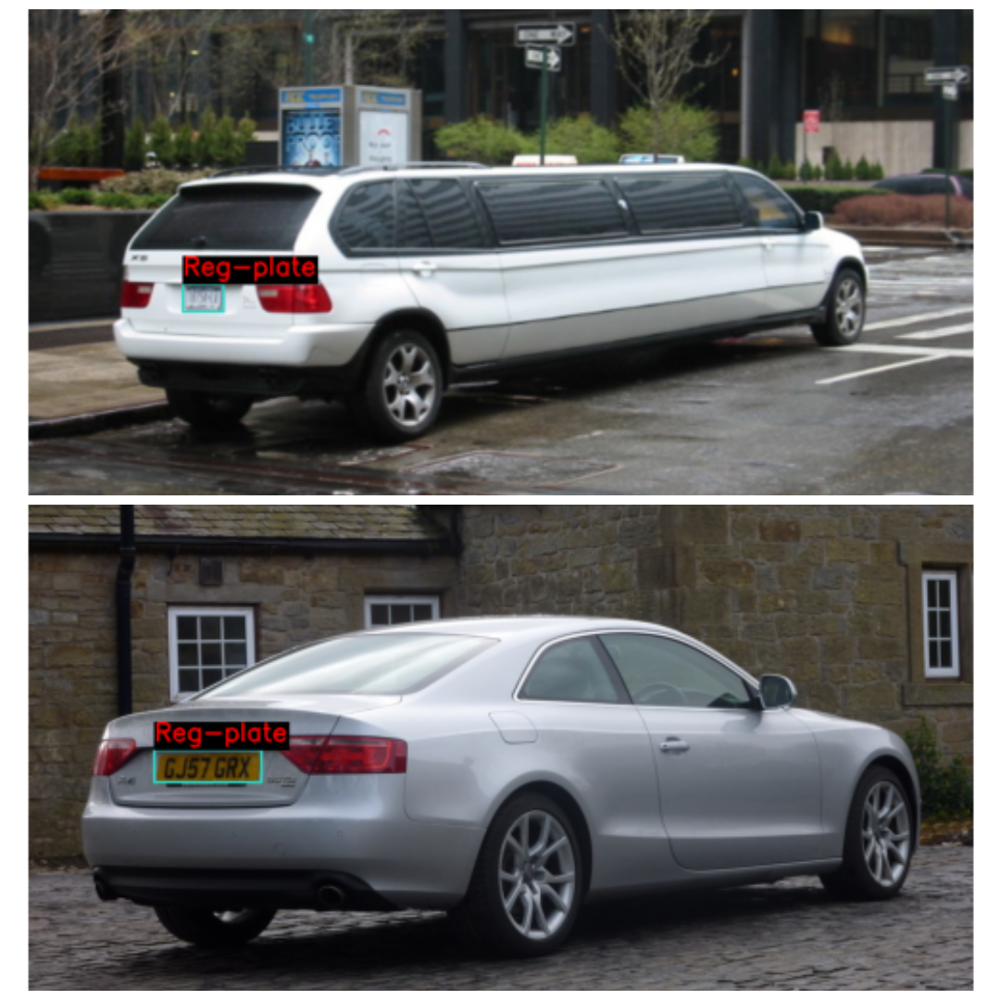

# LicensePlateFinder

LicensePlateFinder implements **YOLOv5** to build a high-precision **License Plate Detection Model**. The model was fine-tuned on a custom dataset and achieved impressive performance:

- **mAP@0.5:0.95**: `0.762`  
- **mAP@0.5**: `0.831` (VOC metric)

---

## Table of Contents

1. [About the Dataset](#about-the-dataset)  
2. [Model and Preprocessing](#model-and-preprocessing)  
3. [Training Configuration](#training-configuration)  
4. [Evaluation Metrics](#evaluation-metrics)  
5. [Inference Results](#inference-results)  

---

## About the Dataset

The dataset comprises **5,694 images** of license plates with bounding box annotations provided in `[xmin, ymin, xmax, ymax]` format. It is organized as follows:

```
Dataset
├── train
│  └── Vehicle registration plate
│      └── Label
└── validation
    └── Vehicle registration plate
        └── Label
```


- **Training Samples**: 5,308  
- **Validation Samples**: 386  

### Sample Images

Below are some images with `ground truth` bounding boxes:  



---

## Model and Preprocessing

The **YOLOv5** model was chosen for its balance between speed and accuracy. Key steps in preprocessing included:

1. **Annotation Conversion**: Converted `[xmin, ymin, xmax, ymax]` **Pascal VOC** bounding box annotations into `[x, y, width, height]` **YOLO** format.  
2. **Data Configuration File**: Prepared a `data.yaml` file with the following details:

```yaml
train: /content/License_Plate_Detection/train/images
val: /content/License_Plate_Detection/validation/images
nc: 1
names: ['Reg-plate']
```
---

## Training Configuration

The model was fine-tuned with the following hyperparameters:

- **Batch Size**: `32`
- **Epochs**: `25`
- **Iterations**: `4,146`
    - calculated as `int(epochs * train_img_count / batch_size)`
- **Initial Learning Rate**: `1e-3`

  

### Evaluation Metrics

The final COCO primary metric `(mAP@0.5:0.95)` was **0.762**, while the `mAP@0.5` (VOC metric) was **0.831**. The overall metric statistics is:

```
 Average Precision  (AP) @[ IoU=0.50:0.95 | area=   all | maxDets=100 ] = 0.762
 Average Precision  (AP) @[ IoU=0.50      | area=   all | maxDets=100 ] = 0.831
 Average Precision  (AP) @[ IoU=0.75      | area=   all | maxDets=100 ] = 0.830
 Average Precision  (AP) @[ IoU=0.50:0.95 | area= small | maxDets=100 ] = 0.222
 Average Precision  (AP) @[ IoU=0.50:0.95 | area=medium | maxDets=100 ] = 0.512
 Average Precision  (AP) @[ IoU=0.50:0.95 | area= large | maxDets=100 ] = 0.862
 Average Recall     (AR) @[ IoU=0.50:0.95 | area=   all | maxDets=  1 ] = 0.669
 Average Recall     (AR) @[ IoU=0.50:0.95 | area=   all | maxDets= 10 ] = 0.798
 Average Recall     (AR) @[ IoU=0.50:0.95 | area=   all | maxDets=100 ] = 0.798
 Average Recall     (AR) @[ IoU=0.50:0.95 | area= small | maxDets=100 ] = 0.233
 Average Recall     (AR) @[ IoU=0.50:0.95 | area=medium | maxDets=100 ] = 0.577
 Average Recall     (AR) @[ IoU=0.50:0.95 | area= large | maxDets=100 ] = 0.895
```


The WandB logs can be found [here](https://wandb.ai/furqansa344-na/opencv_od_project/reports/License-Plate-Detection--Vmlldzo5MjA5NDcx?accessToken=axc7exli81c4oe8ykmppbw6hpz3k95bzn7w9ir8g7tepvi1vvghhokhdoo9d53le).


### Inference Results


---
